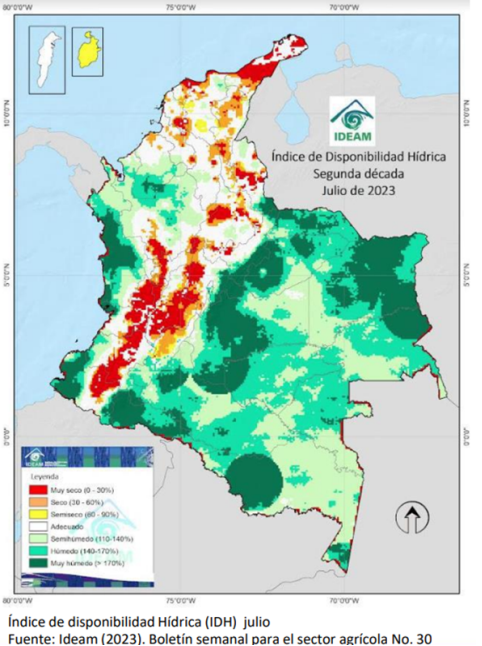

---
output:
  word_document:
    reference_docx: estilos.docx
  pdf_document:
    latex_engine: pdflatex
    keep_tex: yes
    number_sections: yes
  html_document:
    df_print: paged
  classoption: landscape
geometry:
- includeheadfoot
- left=0.60in
- right=0.60in
- top=0.5in
- bottom=1.2in
params:
  month: 7
  year: 2023
  month_b: Noviembre
  trim: II
  fecha_publicacion: 14 de Diciembre de 2022
  directorio: C:/Users/Asus/OneDrive - dane.gov.co/proyecto2/Automatizacion CABYS/Automatizacion/Formato_carpetas
header-includes:
- \usepackage{titling}
- \usepackage{graphicx}
- \usepackage{fancyhdr}
- \usepackage{xcolor}
- \pagestyle{fancy}
- \fancyhead[R]{\includegraphics[width=18cm]{img/Header.png}\\ {\fontfamily{put}\selectfont      \textcolor{gray}{\Large
  `r paste(params$month_b,"de",params$year)`}}}
- \fancyhead[L]{ {\fontfamily{put}\selectfont \textcolor{gray}{\Large `r paste("ISE ",params$month_b," PIB ",params$trim," Trimestre de ",params$year)`}}}
- \setlength{\headheight}{70.83125pt}
- \fancyfoot[R]{\includegraphics[width=18cm]{img/footer.png}\\     \thepage}
- \renewcommand{\footrulewidth}{0pt}
---


`r paste("ISE ",params$month_b," PIB ",params$trim," Trimestre de ",params$year)`

# PRESENTACION DE RESULTADOS Sección A: Agricultura, ganadería, caza, silvicultura y pesca


```{r setup, include=FALSE}
knitr::opts_chunk$set(echo = TRUE)
library(readxl)
library(openxlsx)
library(dplyr)
library(ggplot2)
library(tidyr)
library(scales)
library(lubridate)
library(formattable)
library(plotly)
library(gt)
library(gtExtras)
library(purrr)
library(knitr)
library(tinytex)
library(webshot2)
source("https://raw.githubusercontent.com/juespinosao/CABYS_AGRO/master/R/utils.R")
meses <- c("Ene","Feb","Mar","Abr","May","Jun","Jul","Ago","Sep","Oct","Nov","Dic")
meses_b <- c("Enero","Febrero","Marzo","Abril","Mayo","Junio","Julio","Agosto","Septiembre","Octubre","Noviembre","Diciembre")
```


## Contexto `r paste(meses_b[params$month],"de",params$year)`
\hspace{0.5cm}

### Condiciones Agroclimáticas



El IDH es un indicador agroclimático que permite identificar zonas y periodos con excesos o deficiencias de agua, clasificando las tierras desde muy secas a muy húmedas.

El índice identificó la presencia de tierras húmedas y muy húmedas en:

• Anden del pacifico

• Orinoquía 

• Amazonía

• Norte de Antioquia

• Sur de Córdoba.

Por otro lado, con tierras muy secas, secas y semisecas se identificaron en:

• Oriente de Nariño, Cauca y Valle del Cauca

• Eje cafetero

• Zonas importantes del Huila y del Tolima 

• La Guajira

• Zonas focalizadas en Cundinamarca 
(occidente), Boyacá Santanderes y la región 
Caribe.

Las zonas restantes presentaron un comportamiento adecuado.

**Conclusiones**

• Julio se rigió con probabilidades de ocurrencia del niño altas.

• A pesar de que julio hace parte de la segunda temporada de menos lluvias en la región andina se presentaron lluvias importantes a causa de la transición de sur a norte de la ZCIT, causando influencia de los alisios en el centro del país.

• La Orinoquía presentó lluvias importantes por el comportamiento monomodal característico de la región.

• Se estima que para el mes de agosto los efectos del niño empiecen a notarse generando anomalías por déficit en la región caribe y oriente del país, sin embargo, por las ondas tropicales y la transición de la ZCIT es probable que los efectos del niño debiliten en la región andina.

• Se recomienda activar los planes de prevención ante las crecientes súbitas en alta montaña considerando la influencia de la transición de la ZCIT.

• Se espera que el comportamiento hidrológico de las principales corrientes del país esté dentro de los niveles 
medios, exceptuando las corrientes de la Orinoquia que se espera presenten niveles altos.

• Se recomienda mantener activos los planes de contingencia por posibles ocurrencias de deslizamiento en
zonas inestables.

### Indicadores de precios

```{r}
  carpeta=nombre_carpeta(params$month,params$year)
  IPP_total <- read.xlsx(paste0(params$directorio,"/",params$year,"/",carpeta,"/consolidado_ISE/Precios/anex-IPP-",tolower(nombres_siglas[params$month]),params$year,".xlsx"),
                        sheet = "1.1")
  IPC_total <- read.xlsx(paste0(params$directorio,"/",params$year,"/",carpeta,"/consolidado_ISE/Precios/anex-IPC-",tolower(nombres_siglas[params$month]),params$year,".xlsx"),
                     sheet = "8")
```

*GRAFICO TOTAL*

Para el mes de `r paste0(tolower(meses_b[params$month])," ",params$year)` el IPP total nacional presentó una variación anual de `r paste0()`\%, en paralelo presentó una variación `r paste0(if(4>0){"positiva"}else{"negativa"})` de  `r paste0()`\% respecto al mes inmediatamente anterior (`r if(params$month==1){paste0(tolower(meses_b[12])," ",(params$year)-1)}else{paste0(tolower(meses_b[(params$month)-1])," ",params$year)}`).

Para el mes de `r paste0(tolower(meses_b[params$month])," ",params$year)` el IPC total nacional en su variación anual registró un valor de `r paste0()`\% en comparación con el mismo periodo del año `r paste0((params$year)-1)` y una variación de `r paste0()`\% respecto al mes anterior (`r if(params$month==1){paste0(tolower(meses_b[12])," ",(params$year)-1)}else{paste0(tolower(meses_b[(params$month)-1])," ",params$year)}`).


*GRAFICO 2*

El IPP* de la división de agricultura ganadería, caza silvicultura y pesca para el mes de `r paste0(tolower(meses_b[params$month])," ",params$year)` presento un crecimiento anual de `r paste0()`\%

El IPC de la división de alimentos y bebidas no alcohólicas en el mes de `r paste0(tolower(meses_b[params$month]))`, presentó un crecimiento anual de `r paste0()`\%

*GRAFICO 3*

El IPP de la división de agricultura ganadería, caza silvicultura y pesca, en el mes de `r paste0(tolower(meses_b[params$month]))` presentó un crecimiento anual de `r paste0()`\%

El IPP de Importados de Abonos y Plaguicidas presentó en el mes de `r paste0(tolower(meses_b[params$month]))` un crecimiento anual de `r paste0()`\%

El IPP de Importados de Fabricación de sustancias químicas básicas presentó en el mes de `r paste0(tolower(meses_b[params$month]))` un crecimiento anual de `r paste0()`\%

### Indicadores de insumos

*GRAFICO TOTAL*

En los bovinos, la variación mensual fue `r paste0(if(4>0){"positiva"}else{"negativa"})`, de `r paste0()`\%; en `r paste0(tolower(meses_b[params$month])," de ",(params$year)-1)` se presentó un valor de `r paste0()`\%. Entre enero y `r paste0(tolower(meses_b[params$month]))` del `r paste0(params$year)` la variación acumulada es de `r paste0()`\%; en tanto que, para el mismo periodo del `r paste0((params$year)-1)`, el `r paste0(if(4>0){"incremento"}else{"decrecimiento"})` fue de `r paste0()`\%. En los últimos 12 meses, se observan `r paste0(if(4>0){"incrementos"}else{"decrecimientos"})` de `r paste0()`\%; mientras que entre `r if(params$month==12){paste0(tolower(meses_b[1])," del ",(params$year)-2," y ",tolower(meses_b[(params$month)])," de ",params$year) }else{paste0(tolower(meses_b[params$month+1])," del ",(params$year)-2, " y ",tolower(meses_b[(params$month)])," de ",params$year-1) }` el `r paste0(if(4>0){"aumento"}else{"reducción"})` fue de `r paste0()`\%.

En la porcicultura, también se observó una `r paste0(if(4>0){"aumento"}else{"reducción"})` en los precios promedio de `r paste0()`\% respecto al mes anterior. En lo corrido del año, los precios han `r paste0(if(4>0){"aumentado"}else{"reducido"})` `r paste0()`\% para este segmento, en tanto que, para el mismo periodo del `r paste0((params$year)-1)`, `r paste0(if(4>0){"aumentaron"}else{"reducieron"})` `r paste0()`\%. En los últimos 12 meses, las variaciones acumuladas de los precios alcanzan `r paste0()`\%; para el año inmediatamente anterior, este valor fue `r paste0()`\%. 

En la avicultura, los precios mensuales promedio `r paste0(if(4>0){"subieron"}else{"bajaron"})` `r paste0()`\%. La variación acumulada entre enero y `r paste0(tolower(meses_b[params$month]))` del `r paste0(params$year)` es `r paste0()`\%, mientras que para el mismo periodo del `r paste0((params$year)-1)` el comportamiento fue opuesto, con `r paste0(if(4>0){"incrementos"}else{"decrecimientos"})` de `r paste0()`\%. En los últimos 12 meses, el `r paste0(if(4>0){"incremento"}else{"decrecimiento"})` acumulado es de `r paste0()`\%, en tanto que, entre `r if(params$month==12){paste0(tolower(meses_b[1])," del ",(params$year)-2," y ",tolower(meses_b[(params$month)])," de ",params$year) }else{paste0(tolower(meses_b[params$month+1])," del ",(params$year)-2, " y ",tolower(meses_b[(params$month)])," de ",params$year-1) }` el `r paste0(if(4>0){"aumento"}else{"reducción"})`, fue de `r paste0()`\%.

En la acuicultura, la variación mensual es de `r paste0()`\%; la variación acumulada en lo corrido del año es `r paste0()`\%, para el mismo periodo del `r paste0((params$year)-1)` hubo un `r paste0(if(4>0){"incremento"}else{"decrecimiento"})` de `r paste0()`\%. La variación promedio acumulada en los últimos 12 meses es `r paste0()`\%; entre `r if(params$month==12){paste0(tolower(meses_b[1])," del ",(params$year)-2," y ",tolower(meses_b[(params$month)])," de ",params$year) }else{paste0(tolower(meses_b[params$month+1])," del ",(params$year)-2, " y ",tolower(meses_b[(params$month)])," de ",params$year-1) }`, el `r paste0(if(4>0){"incremento"}else{"decrecimiento"})` fue de `r paste0()`\%,


### Indicadores de oferta agroalimentaria

*GRAFICO TOTAL*

En el mes de `r paste0(tolower(meses_b[params$month]))` de `r paste0(params$year)` ingresaron `r paste0()` toneladas lo que refleja un comportamiento `r paste0(if(4>0){"positivo"}else{"negativo"})` de `r paste0()`\% con respecto al ingreso reportado en el mismo mes del año anterior.

Son los grupos de; **poner los 3 primeros grupos**, que contribuyen de manera más `r paste0(if(4>0){"positiva"}else{"negativa"})` a la variación con `r paste0()`p.p., `r paste0()`p.p. y `r paste0()`p.p. respectivamente.

Solamente contrarresta este comportamiento positivo el grupo de **poner los grupos negativos** con variaciones negativas de `r paste0()`\%

## Actualizaciones

**insertar grafico**

## Resultados Consolidados


\newpage
<!--
\includegraphics[width=18cm]{img/infodane.png}
-->

